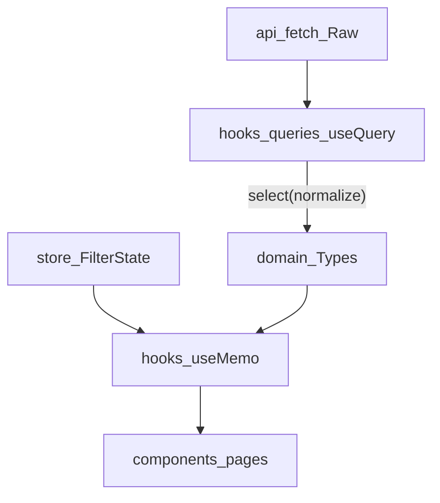

# Dashboard Architecture

이 문서는 **React(Vite) 기반 대시보드**를 위한 아키텍처 규칙을 정의합니다.

- `src/api/**`: **HTTP(axios)만**. React/React Query 코드 금지.
- `src/hooks/queries/**`: **React Query 훅만**. HTTP 함수 호출 + 캐시 전략 관리.
- `src/domain/**`: **순수 TypeScript 도메인 로직만**. React/axios 금지.
- `src/hooks/**`: **파생 데이터 및 UI 로직 훅**. store 필터 + query 결과를 결합해 화면용 데이터를 생성하거나 뷰(View)의 로직을 분리.

---

## 목표

- UI 컴포넌트에서 API 호출/정규화/집계 로직이 뒤섞이지 않게 한다.
- Raw 데이터 → Domain 데이터 변환 규칙을 한 곳(`domain/`)에서 강제한다.
- 전역 상태(store)는 **필터 입력값(원본 state)**만 갖고, 파생 데이터는 hooks에서 계산한다.

---

## 1) 폴더 구조

> 현재 프로젝트에는 `src/components/ui/*`(재사용 UI)와 `src/components/common/*`(공용 컴포넌트)가 이미 존재합니다. 아래 구조는 이를 유지하면서 확장하는 형태입니다.

```text
src/
├── main.tsx                              # 앱 진입점 + MSW 초기화(개발환경)
├── App.tsx                               # Provider 래핑(React Query 등)
│
├── pages/
│   └── Dashboard.tsx                     # 대시보드 페이지(위젯 조합)
│
├── components/                           # 화면(UI) 계층
│   ├── filter/                           # 글로벌 필터 UI
│   ├── trend-chart/                      # 일별 추이 차트 UI
│   ├── campaign-table/                   # 캠페인 테이블 UI
│   ├── campaign-modal/                   # 캠페인 등록 모달 UI
│   ├── platform-donut/                   # 플랫폼 도넛 UI
│   ├── top3-ranking/                     # Top3 랭킹 UI
│   ├── common/                           # 앱 공용(ErrorBoundary, table, modal, form 등)
│   │   ├── table/                        # 데이터 테이블 (Compound Components)
│   │   ├── modal/                        # 폼 다이얼로그 (Compound Components)
│   │   └── form/                         # 공용 폼 필드
│   └── ui/                               # 재사용 UI primitives(shadcn 스타일)
│
├── domain/                               # 도메인(순수 TS, UI/HTTP 독립)
│   ├── campaign/
│   │   ├── types.ts                      # RawCampaign, Campaign, CampaignStatus, Platform
│   │   ├── normalize.ts                  # Raw → Domain 변환(표준화/파싱)
│   │   └── metrics.ts                    # calcMetrics(ctr/cpc/roas)
│   └── daily-stats/
│       ├── types.ts                      # RawDailyStat, DailyStat
│       ├── normalize.ts                  # null/중복 처리
│       └── aggregate.ts                  # aggregateByDate/Campaign/Platform
│
├── api/                                  # HTTP Layer(axios만)
│   ├── axiosInstance.ts                  # axios 인스턴스, baseURL, 인터셉터
│   ├── campaigns.ts                      # fetchCampaigns/createCampaign/updateStatus...
│   └── daily-stats.ts                    # fetchDailyStats...
│
├── hooks/
│   ├── queries/                          # Server State Layer(React Query 훅만)
│   ├── useFilteredData.ts                # 전역 필터 적용 데이터
│   ├── useTableData.ts                   # 테이블 파생 데이터
│   ├── useTrendData.ts                   # 차트 파생 데이터
│   ├── usePlatformData.ts                # 플랫폼 파생 데이터
│   ├── useTop3Data.ts                    # Top3 파생 데이터
│   ├── useCampaignTableController.ts     # 테이블 상태 컨트롤러 훅
│   └── useModal.ts                       # 모달 상태 관리 훅
│
├── store/                                # Global UI State(Zustand)
│   └── filter-store.ts
│
├── lib/                                  # 순수 유틸
│   ├── math.ts                           # safeDivide
│   ├── date.ts                           # 날짜 범위/파싱
│   └── format.ts                         # 원화/퍼센트 포맷
│
├── schemas/                              # Zod 스키마
│   └── campaign-form.ts
│
└── mocks/                                # MSW
    ├── browser.ts
    ├── handlers.ts
    └── db.json                           # 원본 데이터(수정 금지)
```

---

## 2) 전역 상태 구조 (Filter Store)

전역 store는 **필터 입력값(원본 state)**만 보유합니다.

- 날짜는 직렬화/URL 연동 가능성을 고려해 **문자열(ISO)** 권장
- 파생 데이터(필터 적용 결과, 집계 결과 등)는 store에 넣지 않고 `hooks/`에서 계산

```ts
// store/filter-store.ts (개념)
import type { CampaignStatus, Platform } from '@/domain/campaign/types';

export type DateISO = string; // 예: "2026-04-20"

export type FilterState = {
  dateRange: { start: DateISO | null; end: DateISO | null };
  statuses: CampaignStatus[];
  platforms: Platform[];

  setDateRange: (range: { start: DateISO | null; end: DateISO | null }) => void;
  toggleStatus: (status: CampaignStatus) => void;
  togglePlatform: (platform: Platform) => void;
  reset: () => void;
};
```

---

## 3) 데이터 레이어 설계 (4-Step)

### Step 1. HTTP Layer (`src/api/**`)

- **역할**: endpoint 호출만 담당 (axios)
- **출력**: Raw 타입 (`RawCampaign[]`, `RawDailyStat[]`)
- React / React Query 의존성 금지

### Step 2. Server State Layer (`src/hooks/queries/**`)

- **역할**: React Query로 캐싱 / 로딩 / 에러 / 리페치 / 뮤테이션 관리
- **정규화 연결**: `queryFn` 내부에서 `normalize*` 호출하여 캐시에 **Domain 타입**을 저장
  - `select`는 매 렌더마다 재실행되므로 **정규화 같은 무거운 작업은 `queryFn`에서 처리**
  - `select`는 캐시된 Domain 타입의 일부를 뽑아낼 때만 사용
- **캐시 기본값 (권장)**
  - `staleTime`: 5분
  - `gcTime`: 10~30분 (상황에 맞게)
- **mutation 후 처리**: 관련 query key만 `invalidateQueries`

### Step 3. Normalization Layer (`src/domain/**/normalize.ts`)

- **역할**: Raw → Domain 변환 (표준화 / 파싱 / 중복 제거 / 기본값 처리)
- **설계 원칙**
  - **Idempotent**: 몇 번 적용해도 결과가 동일해야 함
  - **Pure**: 외부 상태/사이드이펙트 없음
  - **Single Source of Truth**: 정규화 규칙은 이 파일에만 존재

### Step 4. Aggregation & Metrics Layer (`src/domain/**/aggregate.ts`, `metrics.ts`)

- **Aggregation**: 그룹핑 / 합산 (날짜별, 캠페인별, 플랫폼별 등)
- **Metrics**: CTR / CPC / ROAS 계산 (순수 함수)
- **방어**: `lib/math.ts`의 `safeDivide`로 0 나누기 방지
- **조합 위치**: `src/hooks/**`
  - query 결과(Domain) + store 필터 + `useMemo`로 화면용 파생 데이터를 반환 (`src/hooks/` 내부)

---

## 4) 데이터 흐름(파이프라인)



---

## 5) 정규화(Normalization) 규칙

아래 규칙은 **`domain/*/normalize.ts`에서 일괄 적용**합니다.

- **platform 표준화**
  - `"네이버" → "Naver"`
  - `"Facebook"/"facebook" → "Meta"`
- **status 표준화**
  - `"stopped" → "ended"`
  - `"running" → "active"`
- **budget 파싱**
  - 문자열이면 숫자만 추출해 number로 변환
  - `null`이면 `0`
- **startDate 표준화**
  - 날짜 구분자가 `/`면 `-`로 치환
  - `null`은 Domain에서 표현 가능하도록 유지(필터 제외 여부는 derived/aggregation에서 결정)
- **daily_stats 중복 제거**
  - `(campaignId, date)`를 키로 unique 처리
- **수치 필드 null 처리**
  - 기본 원칙: `null → 0`으로 통일(과제 데이터에서 가장 단순/안전)
- **0 나누기 방어**
  - `safeDivide(n, d)` 사용(분모가 0이면 0 반환 등)

---

## 6) Custom hooks 책임(파생 상태 및 뷰 로직)

Custom hooks(`src/hooks/`)는 “화면이 필요로 하는 형태”로 데이터를 조립하거나 UI의 복잡한 상태 관리를 대신 처리합니다.

- `useFilteredData`: 전역 필터(스토어)가 적용된 데이터 subset 반환
- `useTrendData`: 날짜별 aggregate 및 `dateRange` 계산
- `useTableData`: 검색/정렬을 위한 테이블 데이터(`rows`) 조립
- `usePlatformData`: 플랫폼별 aggregate 및 `percent` 계산
- `useTop3Data`: 정렬, slice, `widthPercent` 계산
- `useCampaignTableController`: `useReactTable` 인스턴스 생성 및 로컬 상태 관리
- `useModal`: 모달(Dialog) 열림/닫힘 제어

원칙:

- 글로벌 필터는 `store/filter-store.ts`만 구독한다.
- 훅은 **파생값만 반환**하거나 로컬 상태만 반환하고, store에 파생값을 저장하지 않는다.
- UI 렌더링 코드와 비즈니스(또는 뷰) 로직을 분리하여 컴포넌트를 얇게 유지한다.

---

## 7) Mocks(MSW) 규칙

MSW는 개발 편의와 과제 요구사항 재현을 위해 사용합니다.

- **`src/mocks/db.json`은 원본 유지**(직접 수정 금지)
- `src/mocks/handlers.ts`에서 **메모리 복사본**을 만들어 변이를 수행한다.
- `POST`/`PATCH`는 **복사본만 수정**한다.
  - 결과적으로 새로고침 시(프로세스 재시작) 초기 상태로 복원되는 것을 전제로 한다.

예시:

```ts
import dbJson from './db.json';

let campaigns = [...dbJson.campaigns]; // 메모리 복사
let dailyStats = [...dbJson.daily_stats];
```
